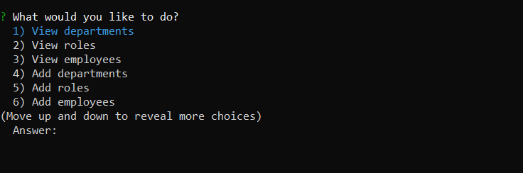
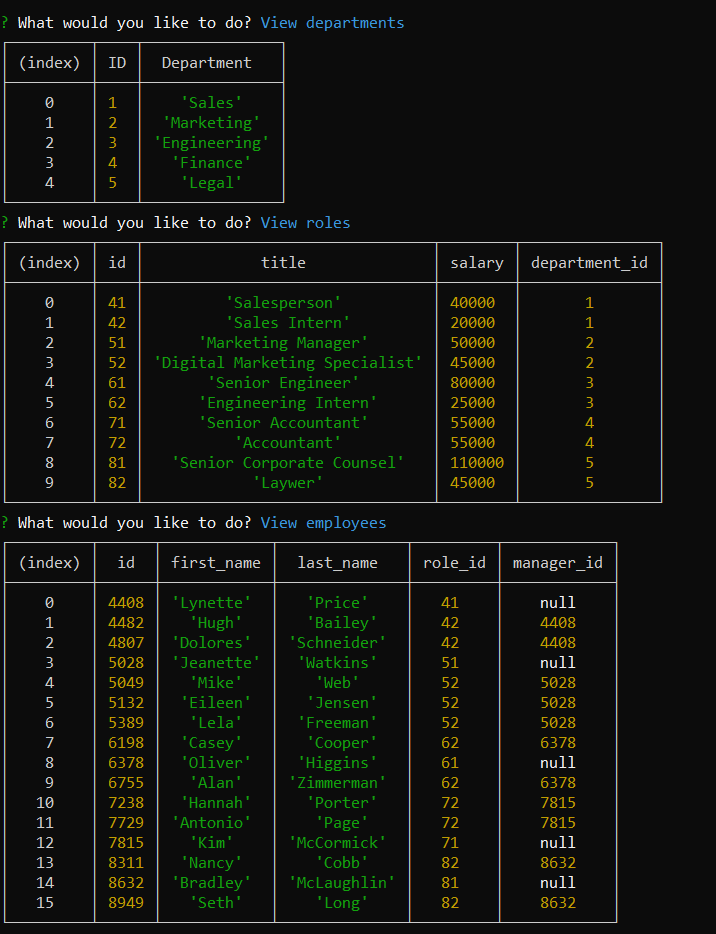
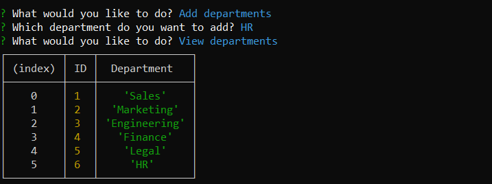
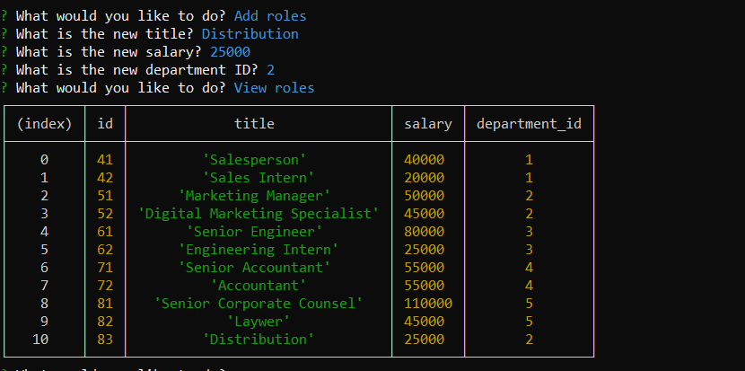
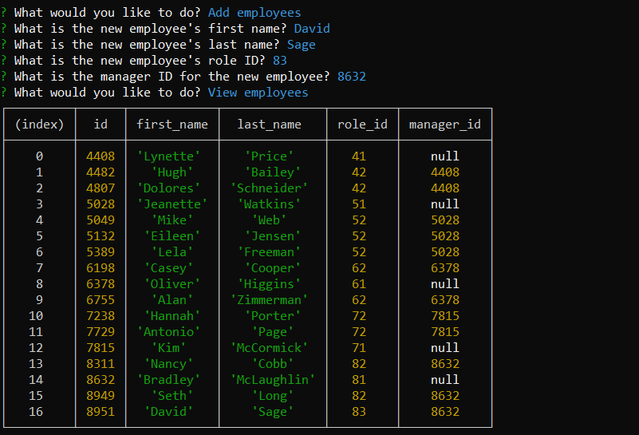
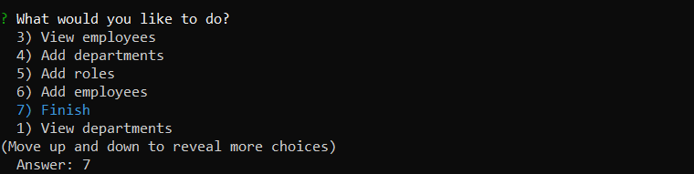

# Employee_Tracker

## Description

This repo is an employee tracker where the user can see and manage their employee list. By using the command prompt, the user will be able to interact with the prompt list to view or add departments, employee roles, and employees.

## User Guides

The user will first run the repo with their command prompt with the command "npm run". After the command has been inputed, a list of options will be presented.

The user is able to view all departments, employee roles, and the employees.

The user is able to add add departments, employee roles, and the employees.

After the user finishes all the updates, select Finish to end the prompt.

